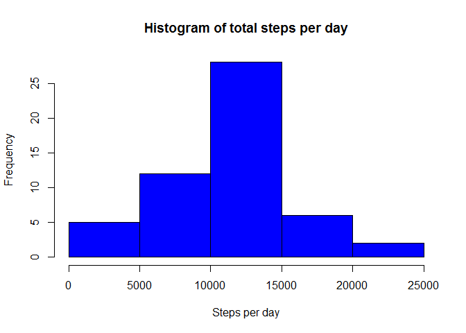
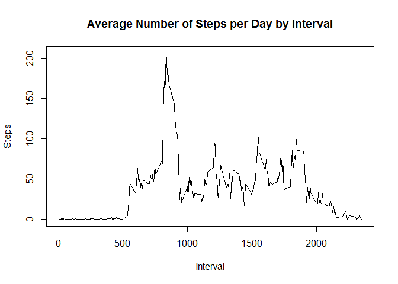
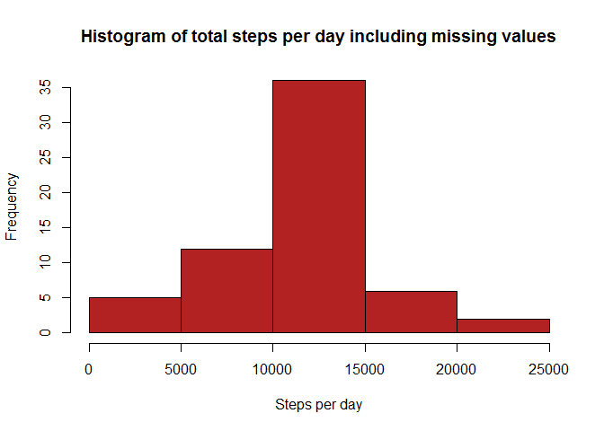
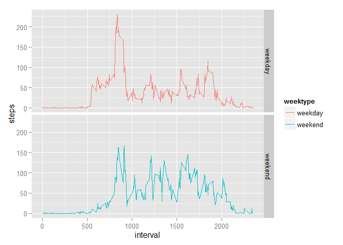

# Reproducible Research: Peer Assessment 1


## Loading and preprocessing the data

```r
library(dplyr)
```

```
## 
## Attaching package: 'dplyr'
## 
## The following objects are masked from 'package:stats':
## 
##     filter, lag
## 
## The following objects are masked from 'package:base':
## 
##     intersect, setdiff, setequal, union
```

```r
library(ggplot2)

activity<- read.csv("activity.csv")
activity$date<- as.Date(activity$date)


## What is mean total number of steps taken per day?
day<- aggregate(steps~date,activity,sum,na.rm=T)
hist(day$steps,main = "Histogram of total steps per day",xlab = "Steps per day",ylab="Frequency",col="blue")
```

 

```r
mean_steps<- mean(day$steps)
median_steps<- median(day$steps)
sprintf("Mean : %f",mean_steps)
```

```
## [1] "Mean : 10766.188679"
```

```r
sprintf("Median : %f",median_steps)
```

```
## [1] "Median : 10765.000000"
```

```r
## What is the average daily activity pattern?
interval<- aggregate(steps~interval,activity,mean,na.rm=T)
plot(interval$interval,interval$steps,type = "l",xlab = "Interval",ylab = "Steps",main = "Average Number of Steps per Day by Interval")
```

 

```r
x<- interval[which.max(interval$steps),]
sprintf("The interval %d has, on average, the highest count of steps, with %f steps.",x[1,1],x[1,2])
```

```
## [1] "The interval 835 has, on average, the highest count of steps, with 206.169811 steps."
```

```r
## Imputing missing values
nas<- is.na(activity$steps)
act_full <- activity
sprintf("Total no. of missing values in dataset : %d",sum(nas))
```

```
## [1] "Total no. of missing values in dataset : 2304"
```

```r
avg_interval<- tapply(act_full$steps,act_full$interval,mean,na.rm=T,simplify = T)
act_full$steps[nas]<- avg_interval[as.character(act_full$interval[nas])] 
day<- aggregate(steps~date,act_full,sum)
hist(day$steps,main = "Histogram of total steps per day including missing values",xlab = "Steps per day",ylab="Frequency",col="firebrick")
```

 

```r
mean_steps<- mean(day$steps)
median_steps<- median(day$steps)
sprintf("Mean : %f",mean_steps)
```

```
## [1] "Mean : 10766.188679"
```

```r
sprintf("Median : %f",median_steps)
```

```
## [1] "Median : 10766.188679"
```

```r
print("The impact of imputing missing data with the average number of steps in the same 5-min interval is that both the mean and the median are equal to the same value: 10766.")
```

```
## [1] "The impact of imputing missing data with the average number of steps in the same 5-min interval is that both the mean and the median are equal to the same value: 10766."
```

```r
## Are there differences in act_full patterns between weekdays and weekends?
act_full<- mutate(act_full,weektype= ifelse(weekdays(act_full$date)=="Saturday" | weekdays(act_full$date)== "Sunday","weekend","weekday"))
interval<- aggregate(steps~interval+weektype,act_full,mean)
qplot(interval,steps,data=interval,geom = "line",facets = weektype~.,color=weektype)
```

 

```r
print("From the two plots it seems that the test object is more active earlier in the day during weekdays compared to weekends, but more active throughout the weekends compared with weekdays (probably because the object is working during the weekdays, hence moving less during the day).")
```

```
## [1] "From the two plots it seems that the test object is more active earlier in the day during weekdays compared to weekends, but more active throughout the weekends compared with weekdays (probably because the object is working during the weekdays, hence moving less during the day)."
```
